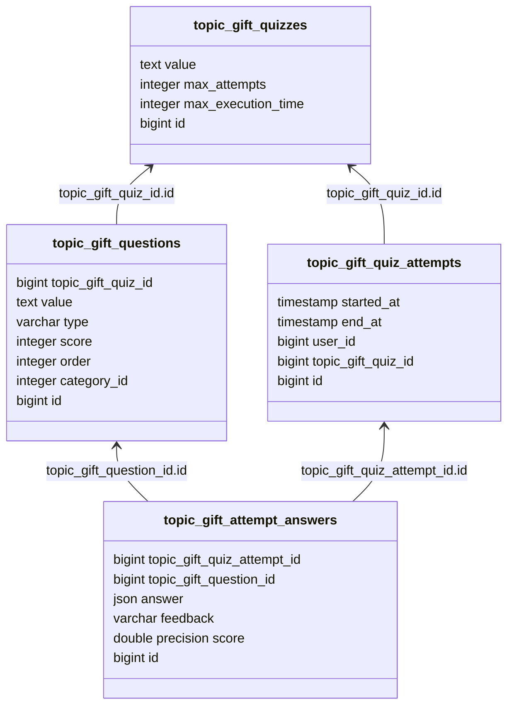
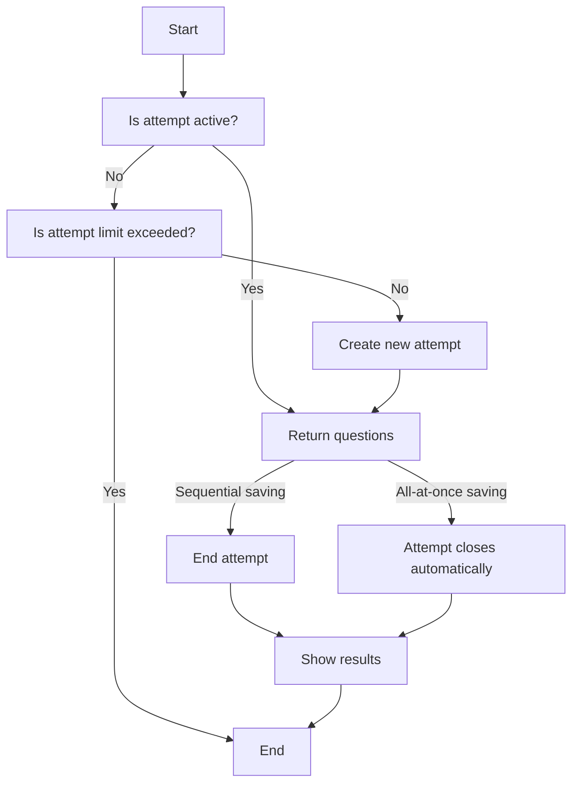

# Topic Type GIFT

## What does it do

This package is another [TopicType](https://github.com/EscolaLMS/topic-types). It is used to make knowledge tests.
If you want to learn more about this format then see [Moodle GIFT format](https://docs.moodle.org/402/en/GIFT_format)

This package supports the following types of questions:
- multiple choice 
- multiple choice with multiple right answers
- true-false
- short answers
- matching
- numerical question 
- essay 
- description

Each question is stored in the database as a string. In the tests you can see examples of questions of different types. See [examples](https://github.com/EscolaLMS/Topic-Type-GIFT/blob/main/tests/GiftQuestionTesting.php)

The quiz can have a set maximum number of attempts for the user to solve the test and a maximum time for each attempt.
If the user doesn't complete the attempt then it is closed automatically after the time set by the variable `Config::get('escolalms_gift_quiz.max_quiz_time');`
The user will see the results when the attempt is finished.

The answer to an essay type question is not automatically graded. The teacher should do it.

## Installing

- `composer require escolalms/topic-type-gift`
- `php artisan migrate`
- `php artisan db:seed --class="EscolaLms\TopicTypeGift\Database\Seeders\TopicTypeGiftPermissionSeeder"`

## Endpoints

The endpoints are defined in 

## Database

See the database schema snippet for a better understanding of how it is made.

## Student flow

See diagram of how student flow works.

## Tests

Run `./vendor/bin/phpunit` to run tests.
Test details 

## Events

- `QuizAttemptStartedEvent` - This event is dispatched when the user starts a new attempt to solve the test.
- `QuizAttemptFinishedEvent` - This event is dispatched when the user has finished solving the test.

## Listeners

This package does not listen for any events.

## Permissions

Permissions are defined in [seeder](https://github.com/EscolaLMS/Topic-Type-GIFT/blob/main/database/seeders/TopicTypeGiftPermissionSeeder.php).
